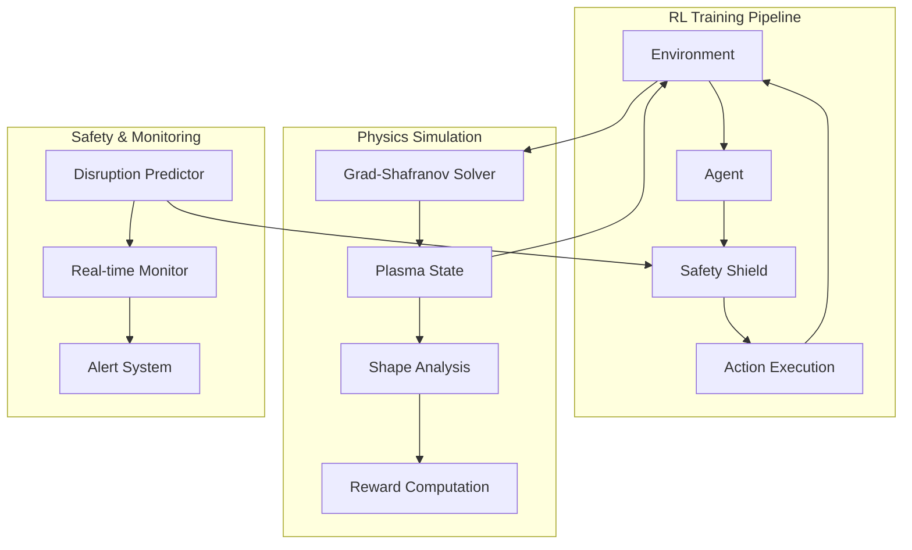

# 🏗️ tokamak-rl-control-suite Architecture

## System Overview

The tokamak-rl-control-suite implements a modular reinforcement learning framework for tokamak plasma shape control, designed for both research and potential deployment in fusion reactors.

## High-Level Architecture



## Core Components

### 1. Environment Layer (`src/tokamak_rl/environment/`)

**Purpose**: Provides Gymnasium-compatible interface for tokamak plasma simulation

**Key Classes**:
- `TokamakEnvironment`: Main environment class implementing Gym interface
- `PlasmaState`: Encapsulates plasma physics state
- `ActionSpace`: Defines control action space (PF coils, heating, gas)
- `ObservationSpace`: Defines state observation space

**Data Flow**:
```
TokamakConfig → Environment → PlasmaState → Observations
     ↓              ↑              ↓            ↑
Actions → ActionProcessor → PhysicsSolver → StateUpdate
```

### 2. Physics Engine (`src/tokamak_rl/physics/`)

**Purpose**: Implements tokamak plasma physics simulation

**Key Components**:
- `GradShafranovSolver`: Solves equilibrium MHD equations
- `ShapeAnalyzer`: Computes plasma boundary and shape parameters
- `SafetyMetrics`: Calculates disruption indicators
- `EquilibriumDatabase`: Manages pre-computed equilibria for speed

**Physics Equations**:
- Grad-Shafranov: `Δ*ψ = -μ₀R²dP/dψ - F dF/dψ`
- Pressure profile: `P(ψ) = P₀(1 - ψⁿ)ᵅ`
- Safety factor: `q(ψ) = F₀/(2π) ∮ dl/(RB_p)`

### 3. RL Agents (`src/tokamak_rl/agents/`)

**Purpose**: Implements state-of-the-art RL algorithms optimized for plasma control

**Supported Algorithms**:
- **SAC (Soft Actor-Critic)**: Off-policy, continuous control
- **Dreamer**: Model-based RL with world models
- **PPO**: On-policy, robust training
- **TD3**: Twin delayed DDPG for continuous control

**Agent Architecture**:
```
Observations → State Encoder → Policy Network → Actions
      ↓              ↓              ↓         ↓
Experience → Replay Buffer → Critic Network → Value Function
```

### 4. Safety Systems (`src/tokamak_rl/safety/`)

**Purpose**: Ensures safe operation and prevents plasma disruptions

**Components**:
- `DisruptionPredictor`: LSTM-based disruption forecasting
- `SafetyShield`: Real-time action filtering
- `ConstraintManager`: Enforces physics constraints
- `EmergencyController`: Fallback classical control

**Safety Pipeline**:
```
Proposed Action → Constraint Check → Disruption Risk → Filtered Action
       ↓               ↓                ↓              ↓
Safety Metrics → Risk Assessment → Emergency Mode → Fallback Control
```

### 5. Monitoring & Visualization (`src/tokamak_rl/monitoring/`)

**Purpose**: Real-time monitoring, logging, and visualization

**Features**:
- TensorBoard integration for training metrics
- Real-time plasma visualization
- Safety alerts and logging
- Performance benchmarking

## Data Architecture

### State Representation (45-dim vector)

```python
observation_space = {
    'plasma_current': Box(0, 20, shape=(1,)),      # MA
    'plasma_beta': Box(0, 0.1, shape=(1,)),        # normalized
    'q_profile': Box(0.5, 10, shape=(10,)),        # safety factor
    'shape_params': Box(-1, 1, shape=(6,)),        # κ, δ, etc.
    'magnetic_field': Box(-10, 10, shape=(12,)),   # PF coil currents
    'density_profile': Box(0, 2e20, shape=(10,)), # electron density
    'temperature': Box(0, 50, shape=(5,)),         # keV
    'error_signals': Box(-10, 10, shape=(1,))      # shape error
}
```

### Action Space (8-dim continuous)

```python
action_space = {
    'pf_coils': Box(-1, 1, shape=(6,)),    # PF coil current adjustments
    'gas_puff': Box(0, 1, shape=(1,)),     # deuterium gas rate
    'heating': Box(0, 1, shape=(1,))       # auxiliary heating power
}
```

## Configuration Management

### Tokamak Configurations

Pre-defined configurations for major tokamaks:
- **ITER**: R=6.2m, a=2.0m, B=5.3T, Ip=15MA
- **SPARC**: R=1.85m, a=0.57m, B=12.2T, Ip=8.7MA  
- **NSTX-U**: R=0.93m, a=0.67m, B=1.0T, Ip=2.0MA
- **DIII-D**: R=1.67m, a=0.67m, B=2.2T, Ip=1.5MA

### Environment Parameters

```yaml
control_frequency: 100  # Hz
simulation_timestep: 0.001  # seconds
episode_length: 1000  # steps
safety_factor_limit: 1.5
density_limit_fraction: 0.8  # of Greenwald limit
beta_limit: 0.04
```

## Performance Characteristics

### Computational Requirements

| Component | CPU Usage | Memory | GPU |
|-----------|-----------|---------|-----|
| Physics Solver | 60% | 2GB | Optional |
| RL Training | 80% | 4GB | Recommended |
| Safety Monitor | 10% | 500MB | No |
| Visualization | 20% | 1GB | Optional |

### Scalability

- **Single Environment**: 1000 Hz real-time simulation
- **Parallel Training**: 16+ environments with MPI
- **Distributed**: Multi-node training with Ray/NCCL
- **Production**: <10ms action latency for real tokamak

## Safety & Reliability

### Fail-Safe Architecture

1. **Redundant Safety Checks**: Multiple independent disruption predictors
2. **Graceful Degradation**: Fallback to classical control if RL fails
3. **Hardware Interlocks**: Direct connection to tokamak safety systems
4. **Audit Logging**: Complete action history for post-incident analysis

### Validation Pipeline

1. **Unit Tests**: Physics solver accuracy, agent behavior
2. **Integration Tests**: End-to-end environment testing
3. **Physics Validation**: Against experimental data
4. **Safety Testing**: Disruption scenario testing
5. **Performance Benchmarks**: Against classical controllers

## Deployment Architecture

### Research Environment
```
Laptop/Workstation → Local Training → Model Export → Analysis
```

### Tokamak Integration
```
Real-time System → Safety Validation → RL Controller → Actuator Commands
       ↑                ↑                  ↓              ↓
Plasma Diagnostics ← Safety Monitor ← Action Filter ← Hardware Interface
```

## Extension Points

### Adding New Algorithms
1. Inherit from `BaseAgent` class
2. Implement `act()`, `learn()`, `save()/load()` methods
3. Register in `agent_factory.py`

### Custom Tokamak Configurations
1. Define geometry in `TokamakConfig`
2. Specify magnetic field coil layout
3. Set physics parameters and constraints

### New Physics Models
1. Implement `PhysicsModel` interface
2. Define state evolution equations
3. Register in environment factory

## Dependencies & Infrastructure

### Core Dependencies
- **Physics**: NumPy, SciPy, Matplotlib
- **RL**: Stable-Baselines3, PyTorch, Gymnasium
- **Monitoring**: TensorBoard, H5PY, PyYAML
- **Optional**: MPI4PY (parallel training), CUDA (GPU acceleration)

### Infrastructure Requirements
- Python 3.8+
- 8GB+ RAM (16GB recommended)
- GPU optional but recommended for training
- Network access for dependency installation

This architecture enables both cutting-edge research and practical deployment while maintaining safety as the paramount concern.